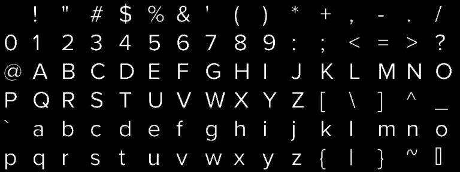
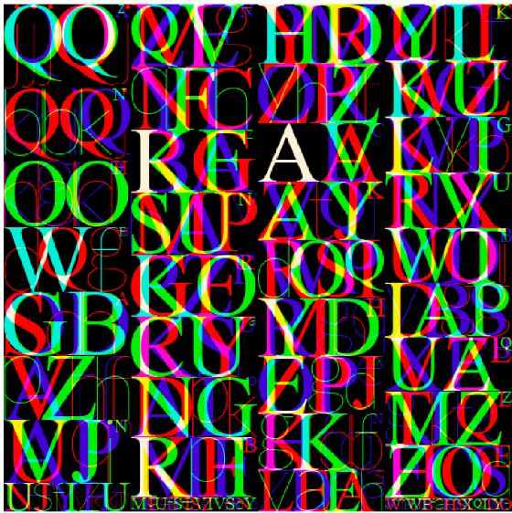
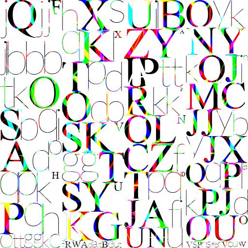

# Description

The project uses cmake definition PROJECT_SOURCE_DIR to determine paths.
The included font files are referenced by the test data, no APIs for font location are in place.

I have revisited the repo after ~half-year, have managed to set it run with Unity in ~3 hours.

The screenshots of rendered glyphs on atlas:

The next two are packing glyphs in red, green, blue and alpha channels of the texture

## Free type
The atlas was using freetype library to render the glyphs, and the following are notes for myself on how to build it.

### Windows

The freetype library for GlyphAtlas on Windows `freetype.lib` was built using: 
`freetype-2.13.0/builds/windows/vc2010/freetype.sln` in `Release Static` configuration.
The included files in this project should be from there.

To address warning `LNK4098: defaultlib 'LIBCMT' conflicts with use of other libs`  
the link options `/NODEFAULTLIB:libcmt.lib /NODEFAULTLIB:libcmtd.lib /NODEFAULTLIB:msvcrtd.lib` were used

### Mac OS / Unix

I have forgotten how The freetype library for GlyphAtlas on Mac OS
`libfreetype.a` and `libfreetyped.a`  
were built , will update this section as I find out or rebuild.